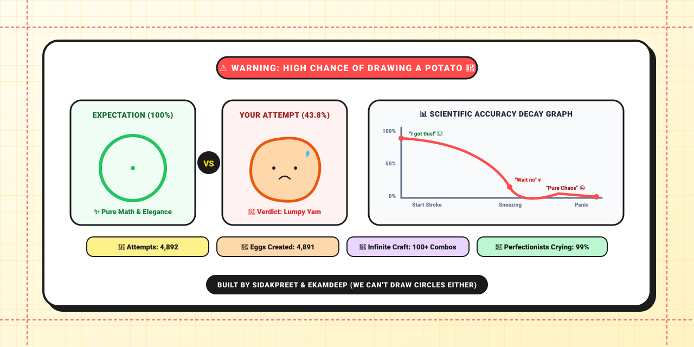
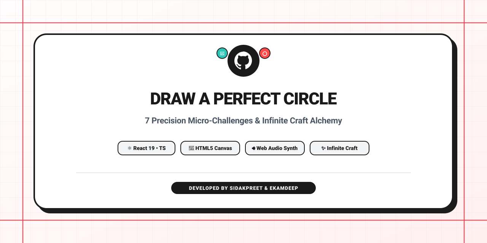

# Draw a Perfect Circle & Precision Suite 🎯

<div align="center">

**🎮 PLAY NOW → [ekamnsidak.github.io/gamehub](https://ekamnsidak.github.io/gamehub/) — free, no download, no signup**

</div>

<div align="center">
  
</div>

<br/>

> **"Expectation: 100% Circle ⭕ | Reality: 43.8% Potato 🥔"**
> 
> A sleek, physics-infused precision micro-game suite and infinite discovery laboratory built with React, TypeScript, Tailwind CSS, HTML5 Canvas, and Gemini AI.
>
> **Developed by Sidakpreet & Ekamdeep**

<details>
<summary><b>📂 View Official Minimalist Repo Card</b></summary>
<br/>
<div align="center">
  
</div>
</details>

---

## 🎮 Included Game Challenges

1. **⭕ Draw a Perfect Circle**
   - Draw a circle in a single continuous stroke.
   - Real-time gesture tracking computes radius variance, centroid stability, and gap closure penalty to score accuracy from 0.0% to 100.0%.
   - Instant visual breakdown with reference circle overlays and dynamic verdict badges.

2. **🧪 Infinite Craft**
   - Combine elements on an open canvas to discover hundreds of emergent recipes.
   - Powered by an AI-assisted alchemy backend with in-memory caching and first discovery tracking.
   - Quick element search, filtering, and instant sharing of discovered discoveries.

3. **📏 The Straight Line**
   - Draw the straightest possible single stroke across any angle.
   - Precision scoring checks linear regression variance, directional deviation, and wobble micro-jitters.

4. **⏱️ The Second**
   - Test your internal biological clock.
   - Press and hold or tap to stop the clock at exactly **1.000s**.
   - Millisecond-level feedback and timing calibration graphs.

5. **🎯 The Middle**
   - Pinpoint the exact visual midpoint or geometric centroid of dynamic polygons, arcs, and abstract shapes across 10 progressive rounds.

6. **🎨 The Color**
   - Test your optical color discrimination.
   - Fine-tune RGB and HSL sliders to match target swatches under varied luminosity conditions.

7. **⬛ The Square**
   - Draw a closed four-sided polygon and evaluate 90° corner perpendicularity, side aspect ratios, and edge straightness.

---

## ✨ Key Features

- **📱 Fully Responsive Canvas Engine**: Native `ResizeObserver` lifecycle management with high-DPI retina display scaling for mobile phones, tablets, and desktops.
- **📊 Master Stats Passport**: Tracks personal bests, total games played, average accuracy indices, and unlocked badges across all 7 challenge modes.
- **🔊 Dynamic Web Audio FX**: Built-in procedural sound synthesizer delivering haptic audio clicks, whooshes, chimes, and fanfare without external audio assets.
- **🎨 Multi-Theme System**: Seamless switching between Warm Paper, Neon Cyber, Pastel Mint, and Dark Mode palettes.
- **🚀 Web Share & Stickers**: Instant score sharing with fallback clipboard support and social copy generation.

---

## 🛠️ Tech Stack

- **Frontend**: [React 19](https://react.dev/), [TypeScript](https://www.typescriptlang.org/), [Tailwind CSS v4](https://tailwindcss.com/), [Motion](https://motion.dev/)
- **Graphics & Visuals**: HTML5 Canvas, [Lucide React](https://lucide.dev/), [Canvas Confetti](https://github.com/catdad/canvas-confetti)
- **Backend / API Proxy**: [Express](https://expressjs.com/), [Node.js](https://nodejs.org/), [@google/genai](https://www.npmjs.com/package/@google/genai)
- **Tooling & Build**: [Vite](https://vitejs.dev/), [esbuild](https://esbuild.github.io/), [tsx](https://github.com/privatenumber/tsx)

---

## 🚀 Getting Started

### Prerequisites
- Node.js 18+ installed
- npm or yarn

### Installation

1. Clone the repository:
   ```bash
   git clone https://github.com/your-username/draw-a-perfect-circle.git
   cd draw-a-perfect-circle
   ```

2. Install dependencies:
   ```bash
   npm install
   ```

3. Configure environment variables (optional for Infinite Craft AI expansions):
   ```bash
   cp .env.example .env
   ```
   Add your Gemini API Key in `.env`:
   ```env
   GEMINI_API_KEY=your_gemini_api_key_here
   ```

4. Start the development server:
   ```bash
   npm run dev
   ```
   Open [http://localhost:3000](http://localhost:3000) in your browser.

---

## 📦 Build & Deployment

To generate a production-ready build:

```bash
npm run build
```

To start the production server:

```bash
npm run start
```

## 🌐 GitHub Pages Deployment (`https://ekamnsidak.github.io/gamehub/`)

This repository is pre-configured for automated zero-config deployment to GitHub Pages via GitHub Actions:

### 1. Enable GitHub Actions as Pages Source
1. In your GitHub repository (`ekamnsidak/gamehub`), go to **Settings**.
2. Under **Code and automation** in the sidebar, click **Pages**.
3. Under **Build and deployment** > **Source**, select **GitHub Actions**.
4. Push to `main` branch or trigger manually under the **Actions** tab. The automated workflow `.github/workflows/deploy.yml` will build and publish the live site to:
   👉 **`https://ekamnsidak.github.io/gamehub/`**

### 2. Static Hosting Solution for Infinite Craft (`/api/combine`)
GitHub Pages is a static file host that does not run custom Express/Node.js servers. To ensure Infinite Craft runs smoothly without backend requirements:
- **Offline Recipe Database**: Pre-bundled with 200+ popular alchemical recipes that resolve with 0ms latency in the browser.
- **Client-Side Procedural Alchemy Engine**: Dynamically synthesizes emergent element pairings and assigns contextual emojis right in the browser using semantic traits.
- **Local Cache Persistence**: Discovered elements and custom combinations are automatically stored in `localStorage` (`infinite_craft_static_combos`).
- **Hybrid Backend Detection**: When running locally or on a Node.js server, `/api/combine` seamlessly augments the game with Gemini LLM logic. When deployed to GitHub Pages, the client-side alchemy engine takes over with 100% feature parity.

---

## 🔍 SEO & Google Search Console

The site ships with a full SEO layer, ready for indexing:

| Asset | Purpose |
|---|---|
| Keyword-rich `<title>` + meta description/keywords | Primary on-page SEO for "draw a perfect circle", "infinite craft", "precision games" etc. |
| `<link rel="canonical">` | Canonical URL: `https://ekamnsidak.github.io/gamehub/` |
| Open Graph + Twitter Card tags & `og-image.png` (1200×630) | Rich link previews on WhatsApp, X, Facebook, LinkedIn, Discord |
| JSON-LD structured data (`WebSite`, `WebApplication` + 7 `VideoGame` entries, `FAQPage`) | Google rich results & sitelinks eligibility |
| `robots.txt` + `sitemap.xml` | Crawler directives & discovery |
| `site.webmanifest` + favicons (SVG/ICO/PNG/Apple touch) | PWA installability & branded browser tabs |
| Hash deep links (`#circle`, `#craft`, `#line`, `#second`, `#middle`, `#color`, `#square`) + per-game `document.title` | Shareable game links & descriptive titles |

### Verify ownership in Google Search Console

Ownership is verified via the **HTML file** method — `public/googlec366c670576d1948.html` is served at
`https://ekamnsidak.github.io/gamehub/googlec366c670576d1948.html`.

1. Open [Google Search Console](https://search.google.com/search-console) → **Add property** → **URL prefix** → `https://ekamnsidak.github.io/gamehub/`.
2. With the verification file deployed (merged to `main`), click **Verify**.
3. After verification, go to **Sitemaps** in the sidebar and submit: `https://ekamnsidak.github.io/gamehub/sitemap.xml`.
4. Optional: use **URL Inspection** on `https://ekamnsidak.github.io/gamehub/` and hit **Request Indexing** to speed up the first crawl.
5. Keep the verification file in the repo permanently — Google re-checks it periodically.

### Validate structured data

- Rich results: https://search.google.com/test/rich-results
- Schema markup: https://validator.schema.org/
- Social previews: https://www.opengraph.xyz/ (or the X Card Validator)

---

## 👥 Credits & Authors

- **Developed by**: Sidakpreet & Ekamdeep
- **License**: MIT
